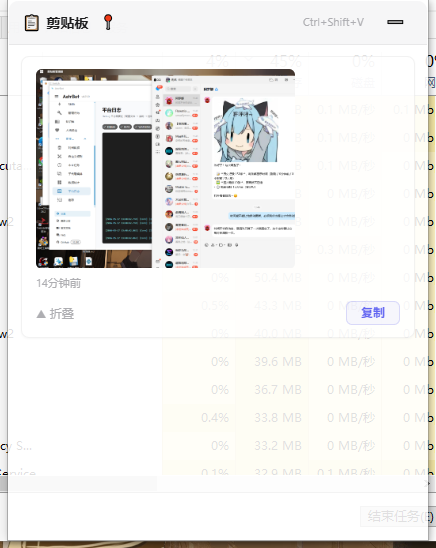

# 剪贴板管理器 / Clipboard Manager

一款轻量级、高颜值的 Windows 剪贴板历史记录工具。基于 Tauri 构建，原生性能，内存占用低。



---

## 功能特色

- 📋 **实时监控剪贴板** — 自动记录复制的文本和图片，无需手动保存
- 🖼️ **图片预览** — 支持剪贴板图片的预览和再次复制
- ⚡ **全局快捷键** — `Ctrl+Shift+V` 一键呼出/隐藏，即用即走
- 📌 **窗口置顶** — 可置顶窗口，方便随时查阅
- 🔍 **搜索过滤** — 快速查找历史记录
- 🗑️ **右键删除** — 不需要的记录随时清除
- 🚀 **开机自启** — 安装即自动开机静默启动，不打扰
- 💎 **毛玻璃界面** — 圆角半透明毛玻璃设计，融入桌面
- 🪶 **轻量高效** — 仅 ~10MB，内存占用极低

## 使用方式

| 操作 | 说明 |
|------|------|
| `Ctrl+Shift+V` | 呼出/隐藏窗口 |
| 单击卡片 | 展开/收起完整内容 |
| 点击「复制」按钮 | 复制内容到剪贴板 |
| 右键卡片 | 置顶/删除 |
| `Esc` | 隐藏窗口 |
| 顶部搜索框 | 过滤历史记录 |

## 下载安装

前往 [Releases](https://github.com/xiaoweihua1/clipboard-manager/releases) 页面下载最新版安装包：

- `clipboard-manager_1.0.0_x64-setup.exe` — Windows 安装包（推荐）
- `clipboard-manager_1.0.0_x64_en-US.msi` — MSI 安装包

> 安装后会自动加入开机启动，按 `Ctrl+Shift+V` 即可使用。

## 自行编译

### 环境要求

- Node.js 18+
- Rust 1.70+
- Windows 10/11（需 WebView2，系统自带）

### 编译步骤

```bash
# 克隆仓库
git clone https://github.com/xiaoweihua1/clipboard-manager.git
cd clipboard-manager

# 安装前端依赖
npm install

# 开发模式运行
npm run tauri dev

# 构建发布版本
npm run tauri build
```

构建产物在 `src-tauri/target/release/bundle/` 目录下。

## 技术栈

| 层 | 技术 |
|------|------|
| 前端框架 | React 18 + TypeScript |
| 桌面框架 | Tauri 2.x |
| 后端语言 | Rust |
| 剪贴板 | arboard + tauri-plugin-clipboard-manager |
| 图片处理 | image-rs |
| 全局快捷键 | tauri-plugin-global-shortcut |
| 开机自启 | tauri-plugin-autostart |

## 许可证

MIT License
